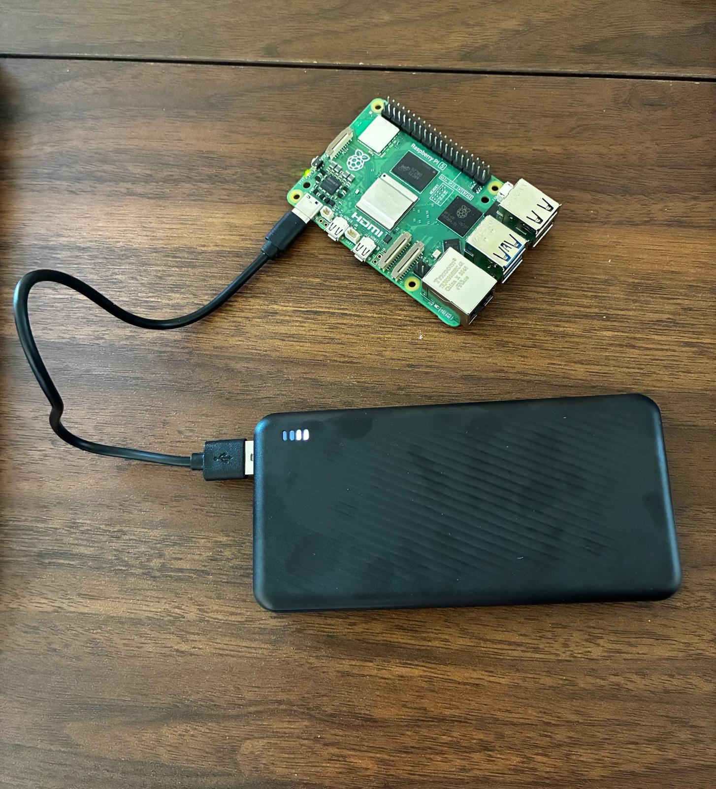

# AI Security Camera

A Raspberry Pi 5 edge vision appliance that watches a room, detects motion and objects, tracks movement through zones, saves evidence clips, and generates incident reports from camera activity.


## Features

This is built like a small commercial edge device, not a tutorial script.

- Embedded deployment on Raspberry Pi 5 with systemd.
- Camera ingestion from USB cameras or an MJPEG network stream.
- OpenCV motion detection and centroid tracking.
- YOLOv8n ONNX object detection through OpenCV DNN.
- Event-triggered screenshots and video clips with 4-second pre-event and 8-second post-event windows.
- Automatic history pruning that keeps the latest 5 events, reports, and clips.
- SQLite event storage.
- FastAPI backend and local dashboard.
- Natural-language incident reports.
- Thermal-aware workload control that lowers FPS, slows YOLO, and pauses detection at critical heat.
- Human-in-the-loop object labels that persist across restarts and relabel matching future detections.
- Runtime health status including FPS, detector mode, temperature, and throttle state.

Operational identifiers such as `vision-appliance.service`, `/opt/vision-appliance`, and the `vision-appliance` command are kept stable so existing Pi installs continue to work.

## Hardware Setup

Raspberry Pi 5 powered by a portable power bank for edge deployment:



## Architecture

```text
Camera source
  -> OpenCV capture
  -> Motion detection
  -> YOLO ONNX object detection
  -> Centroid tracker
  -> Event generator
  -> SQLite event store
  -> Evidence recorder
  -> FastAPI dashboard and API
```

Useful docs:

- [Interview guide](docs/interview-guide.md)
- [Operations runbook](docs/operations-runbook.md)

## Dashboard

The local dashboard shows:

- Annotated live camera feed
- FPS, detector mode, and Pi temperature
- Active thermal throttle mode
- Active object tracks
- Learned object labels
- Configured zones
- Event timeline
- Saved clips and screenshots
- Generated reports

Open:

```text
http://<pi-ip>:8080
```

## API

- `GET /status`
- `GET /health`
- `GET /events`
- `GET /latest-frame`
- `GET /stream`
- `GET /clips`
- `GET /frames`
- `GET /object-labels`
- `POST /objects/{track_id}/label`
- `DELETE /object-labels/{profile_id}`
- `POST /object-labels/reset`
- `POST /reports/generate`

## Local Laptop Demo

```powershell
python -m venv .venv
.\.venv\Scripts\Activate.ps1
pip install -r requirements.txt
pip install --upgrade setuptools wheel
pip install -e . --no-build-isolation
copy .env.example .env
vision-appliance
```

Open:

```text
http://127.0.0.1:8080
```

## Laptop Webcam As Network Camera

A laptop's built-in webcam is not a USB device the Pi can open directly. For demos, run an MJPEG streamer on Windows and point the Pi at that stream.

Windows PowerShell:

```powershell
cd "C:\Users\Neel\Documents\Security Camera"
.\.venv\Scripts\python.exe scripts\laptop_camera_streamer.py --camera-index 0 --port 8090 --fps 24 --width 960 --height 540
```

Pi env:

```bash
sudo sed -i 's|^VISION_CAMERA_SOURCE=.*|VISION_CAMERA_SOURCE=http://10.0.0.198:8090/stream.mjpg|' /etc/vision-appliance.env
sudo systemctl restart vision-appliance
curl http://127.0.0.1:8080/status
```

## Raspberry Pi Deployment

From WSL on Windows:

```bash
cd "/mnt/c/Users/Neel/Documents/Security Camera"

rsync -az --delete \
  -e "ssh -i ~/.ssh/pi5_edge" \
  --exclude ".git" \
  --exclude ".venv" \
  --exclude ".ultralytics" \
  --exclude "data" \
  ./ pi5@10.0.0.199:~/vision-appliance/

ssh -i ~/.ssh/pi5_edge -t pi5@10.0.0.199 \
  'cd ~/vision-appliance && sudo scripts/install_pi.sh'
```

Service commands on the Pi:

```bash
sudo systemctl status vision-appliance --no-pager -l
sudo journalctl -u vision-appliance -f
sudo systemctl restart vision-appliance
```

## YOLO ONNX Object Detection

Export on the laptop:

```powershell
cd "C:\Users\Neel\Documents\Security Camera"
.\.venv\Scripts\python.exe -m pip install -r requirements-yolo-export.txt
.\.venv\Scripts\python.exe scripts\export_yolo_onnx.py --model yolov8n.pt --output models\yolov8n.onnx --imgsz 640
```

Enable on the Pi:

```bash
sudo tee -a /etc/vision-appliance.env >/dev/null <<'EOF'
VISION_ONNX_MODEL=/opt/vision-appliance/models/yolov8n.onnx
VISION_LABELS_FILE=/opt/vision-appliance/models/coco.names
VISION_ONNX_INPUT_SIZE=640
VISION_DETECT_LABELS=person,backpack,handbag,suitcase,laptop,cell phone,bottle,cup,book,keyboard,mouse,remote,chair,tv
VISION_DETECTION_INTERVAL=8
VISION_CONFIDENCE_THRESHOLD=0.35
EOF

sudo systemctl restart vision-appliance
curl http://127.0.0.1:8080/status
```

`detector: onnx` means YOLO is active. The thermal guard can also increase the effective detection interval automatically when the Pi warms up.

## Thermal Safety

The Pi 5 needs active cooling for sustained YOLO/OpenCV workloads.

The service now includes an automatic thermal guard:

- `normal`: configured FPS and detection interval.
- `warm`: lower FPS and run YOLO less often.
- `hot`: heavier workload reduction.
- `critical`: keep the dashboard stream alive at low FPS but pause motion/object detection until the Pi cools.
- Temperature is sampled once per minute by default through `VISION_THERMAL_SAMPLE_SECONDS=60`.

Check the current mode:

```bash
curl http://127.0.0.1:8080/status
```

If temperature reaches 85 C:

```bash
sudo systemctl stop vision-appliance
vcgencmd measure_temp
vcgencmd get_throttled
```

Safer demo settings:

```bash
sudo sed -i 's|^VISION_FPS=.*|VISION_FPS=12|' /etc/vision-appliance.env
sudo sed -i 's|^VISION_DETECTION_INTERVAL=.*|VISION_DETECTION_INTERVAL=12|' /etc/vision-appliance.env
sudo sed -i 's|^VISION_ONNX_INPUT_SIZE=.*|VISION_ONNX_INPUT_SIZE=320|' /etc/vision-appliance.env
sudo systemctl restart vision-appliance
```

## Object Labels

The dashboard lets an operator label an active track, such as `work backpack` or `bench laptop`. Labels reset when a fresh dashboard browser session opens, so demo labels do not leak into the next run. During a session, the system stores a lightweight label profile in SQLite using the detector's base class plus normalized position and size. When a matching object appears later, the dashboard, event timeline, reports, and saved evidence use the friendly label while the original detector class is still kept for rules like unattended-object detection.

## Evidence Clips

Each event saves an annotated screenshot and starts an evidence clip. Clips include the previous 4 seconds from the in-memory frame buffer and continue recording for 8 seconds after the event trigger. Tune this with:

```bash
VISION_CLIP_SECONDS_BEFORE=4
VISION_CLIP_SECONDS_AFTER=8
VISION_HISTORY_LIMIT=5
```

The Pi installer includes `ffmpeg` so clips are encoded as browser-playable H.264 MP4 files. If older clips show "No video with supported format and MIME type found," they were likely recorded with the previous OpenCV `mp4v` codec; new clips after redeploy should play directly in the browser.

## Project Layout

- `src/vision_appliance/camera.py` - camera capture and overlays
- `src/vision_appliance/motion_detector.py` - foreground motion regions
- `src/vision_appliance/object_detector.py` - YOLO ONNX plus fallback detector
- `src/vision_appliance/object_labeler.py` - persisted operator labels for recurring objects
- `src/vision_appliance/object_tracker.py` - centroid tracking
- `src/vision_appliance/thermal_guard.py` - thermal-aware workload control
- `src/vision_appliance/event_generator.py` - incident rules
- `src/vision_appliance/video_recorder.py` - pre/post event clips and screenshots
- `src/vision_appliance/api.py` - FastAPI service
- `src/vision_appliance/static/` - dashboard
- `deploy/systemd/` - Pi service files
- `docs/` - interview and operations notes
